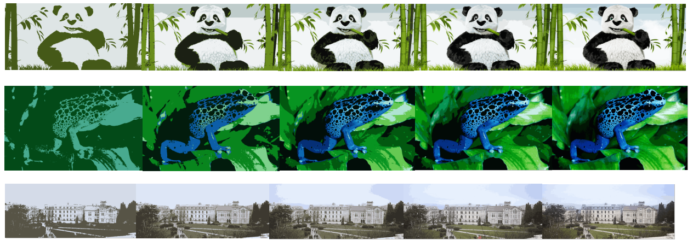
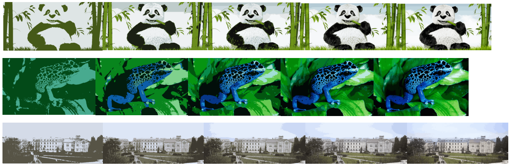
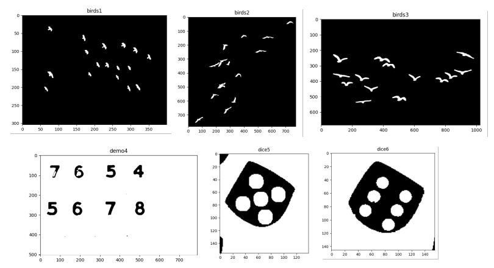

# Various Computer Vision (CV) Implementations

This repository showcases various implementations of fundamental computer vision techniques. Each method is explained below, with visual results provided.

## 1. Color Quantization

Color quantization is a technique used in image processing and computer graphics to reduce the number of distinct colors in an image. This approach is useful for several reasons:

- **Reduced Memory Usage:** Optimizes file sizes for efficient storage or transmission, especially useful when working with limited resources.
- **Compression and Bandwidth Optimization:** Simplifies the transmission or storage of images, which is particularly beneficial in environments with limited bandwidth.

### Implementations

- **With Manually Selected Centers:**
  
  The image is processed using manually selected color centers for quantization.

  

- **With Randomly Selected Centers:**
  
  The image is processed using randomly selected color centers for quantization.

  

## 2. Connected Component Analysis

Connected Component Analysis is a fundamental image processing technique used to identify and analyze distinct regions or objects within an image. It is commonly used in various applications such as object detection, segmentation, and image recognition.

## 3. Bag-of-Features (BoF) Implementation

This implementation uses the `kornia`, `kornia_moons`, and `OpenCV` libraries to demonstrate a Bag-of-Features model, a popular technique for image classification and retrieval.

### Steps Involved

1. **Feature Extraction and Encoding:**
   - Extract local features (detectors) from images using OpenCV.
   - Encode the features into fixed-length vector representations (descriptors) using SIFT and HyNet methods.

2. **Codebook Construction and Feature Quantization:**
   - Construct a codebook by clustering local features into visual codewords using k-means. Each codeword represents a cluster center or prototype of similar features.

3. **Histogram Creation:**
   - Use the quantized visual codewords to build a histogram representation, known as the Bag-of-Features representation, which counts the occurrence of each visual codeword in the image.

4. **Classification:**
   - Use Multi-Layer Perceptron (MLP) and Support Vector Machine (SVM) classifiers to categorize the images based on the Bag-of-Features representation.

